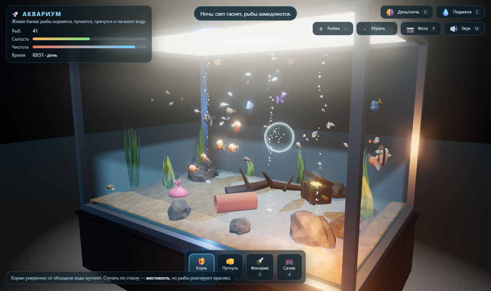

# 🐠 Аквариум 3D на three.js

Интерактивная банка с живой рыбой: её можно кормить, пугать, подсветить фонарём,
поймать сачком и подлететь поближе. Никаких серверов и CDN — всё рисуется процедурно.



> Собрано ИИ-агентом на локальной модели **qwen-next-local**.

## Запуск

| способ | что делать |
|---|---|
|обычно | дважды кликнуть по `index.html` (рядом должен лежать `aquarium.js`) |
| одним файлом | открыть `aquarium_standalone.html` — вся банка в одном HTML |

Работает по `file://`: никакого сервера, сборки на месте и внешних загрузок не требуется.
Нужен только браузер с WebGL2 (Chrome / Edge / Firefox / Safari 15+).

## Управление

| действие | как |
|---|---|
| Бросить корм | ЛКМ по воде с инструментом «🍤 Корм» (`1`) — еда тонет, косяк слетается |
| Постучать по стеклу | «👊 Пугнуть» (`2`) — ударная волна, паника, рыба-шар раздувается |
| Фонарик | «🔦 Фонарик» (`3`) — манит любопытных и тревожит пугливых |
| Сачок | «🥅 Сачок» (`4`) — за рыбой гоняются по всей банке |
| Приближение | колесо мыши |
| Вращение / сдвиг | ПКМ — орбита, средняя кнопка — панорама |
| Следить за рыбой | двойной клик по рыбе, `Esc` — отпустить |
| Сутки | `D` — свет гаснет, рыбы замедляются и ложатся отдыхать |
| Подмена воды | `C` — вода снова прозрачная |
| Больше / меньше рыбы | `+` / `−` |
| Фото кадра | `P` (PNG в загрузки) |
| Звук | `M` — процедурные щелчки, всплески, шуршание |

## Что внутри

- **10 видов рыб** с разным характером: неоны и зебры держатся косяком,
  скалярии и петушок территориальны, сомики-присоски чистят дно,
  рыба-шар раздувается от испуга, золотые рыбки подплывают к человеку.
- Поведение: моделирование стаи (boids) + конечный автомат
  `блуждание / поиск корма / бегство / любопытство / дом / укрытие / отдых`.
  Рыбы голодают, едят, пачкают воду и прячутся ночью.
- **Кормление имеет последствия**: перекорм → муть → падает свечение и видимость;
  сомики и улитки вычищают остатки, подмена воды (`C`) сбрасывает баланс.
- Всё нарисовано кодом: текстуры чешуи, плавников, камня, дерева и песка
  генерируются в CanvasTexture, окружение — через `PMREMGenerator`.
- Анимация плавания и покачивание растений живут в вершинных шейдерах
  (`onBeforeCompile`), а не на CPU.
- Каустика по песку и стенкам, объёмные лучи света, туман по мутности,
  bloom, тени, стеклянные панели на собственном френелевском шейдере.
- **Авто-качество**: если FPS проседает, банка сама отключает свечение и тени;
  софтверный GL сразу стартует в облегчённом режиме.

## Сборка из исходников

```bash
npm install
npm run build     # esbuild -> aquarium.js (IIFE, работает с file://)
npm run test      # поведенческий харнес без GPU (node _harness.mjs)
npm run watch     # пересборка на сохранение
```

`src/` — исходники: `config.js`, `noise.js`, `textures.js`, `tank.js`, `species.js`,
`fishModel.js`, `fish.js`, `props.js`, `food.js`, `interaction.js`, `audio.js`,
`ui.js`, `main.js`. Зависимость одна: `three@0.160.1`.

## Отладочные ключи URL

| ключ | эффект |
|---|---|
| `?quality=low` / `?lite=1` | без свечения и теней |
| `?quality=high` | принудительно полное качество |
| `?phase=0.5` | сразу глубокая ночь (`0` — полдень) |
| `?nobloom=1` `?noshadow=1` `?nomsaa=1` | отключить отдельный эффект |
| `?autotest=1` | scripted-прогон + JSON-статистика внизу экрана |
| `?autotest=1&notestline=1` | то же, но без строки статистики |
| `?hide=waterSurface,shafts` | скрыть объект по имени (отладка картинки) |

## Живая страница

Банка открывается прямо в браузере:
**https://webtitovdev.github.io/aquarium-3d-qwen-next-local/**

Репозиторий сделан публичным именно ради этой ссылки — на бесплатном тарифе
GitHub Pages доступен только публичным репозиториям. Обновление страницы —
обычный `git push` в `main`, GitHub пересобирает её примерно за минуту:

```bash
npm run build
git commit -am "обновление сборки" && git push
```

